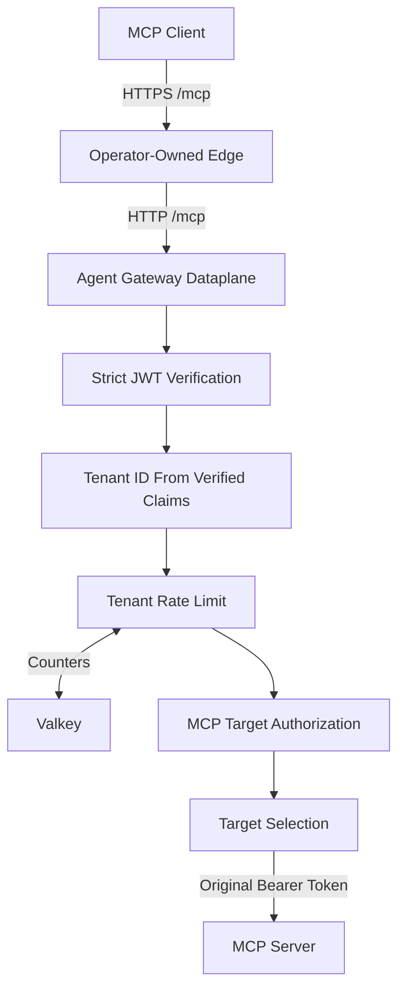
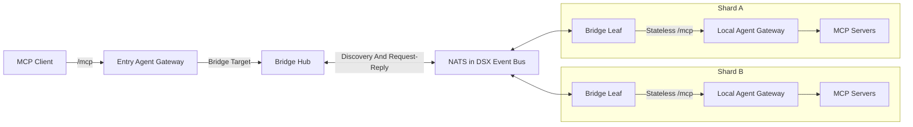

DSX Agent Gateway provides one policy enforcement and routing layer between MCP clients and MCP servers. The standard request path routes directly to targets that one gateway can reach. The optional bridge extends selected requests to gateway shards through the DSX Event Bus.

## Components

The Helm chart coordinates the following components:

| Component | Responsibility |
| --------- | -------------- |
| Operator-owned edge | Terminates external TLS and routes HTTP traffic to the gateway Service. |
| Agent Gateway controller | Programs Agent Gateway resources from Kubernetes Gateway API and Agent Gateway custom resources. |
| Agent Gateway dataplane | Accepts `/mcp` traffic and applies authentication, authorization, rate limiting, and target routing. |
| Rate-limit service | Evaluates request limits with counters keyed by the verified tenant ID. |
| Valkey | Stores counters for the bundled rate-limit service. |
| MCP target | Serves MCP through a discovered Kubernetes Service or a configured static endpoint. |
| Bridge hub | Exposes reachable shards and routes selected MCP requests through NATS. |
| Bridge leaf | Receives work for one shard and forwards it through that shard's local gateway. |
| DSX Event Bus | Provides NATS request-reply transport for the optional bridge. |

The bridge components and DSX Event Bus are optional. Direct target routing does not use NATS.

## Direct Request Flow

The following diagram shows the policy and routing stages for a direct request:

The gateway processes a direct request as follows:

1. The operator-owned edge sends an HTTP request to the gateway's `/mcp` route.
1. The dataplane verifies the JWT issuer, audience, signature, and token validity against a configured provider.
1. A Common Expression Language (CEL) expression derives a nonempty tenant ID from the verified JWT claims.
1. The rate-limit service uses the tenant ID to select the tenant's request budget.
1. MCP authorization permits the operator tenant to use all targets.
1. MCP authorization limits every other tenant to configured target names.
1. Agent Gateway selects the target and forwards the caller's original bearer token.
1. The MCP server applies any server-specific authorization and processes the request.

The chart rejects a tenant expression that reads request headers or does not reference verified `jwt.*` claims. Caller-supplied identity headers therefore do not define the tenant used for authorization or rate limiting.

At least one JWT provider is required. Each provider has a unique issuer, one or more allowed audiences, a JSON Web Key Set (JWKS) URL, and its own tenant expression. A token can contain additional audiences when at least one audience matches the provider configuration.

The rate-limit service keeps counters separate by derived tenant ID. Operators can configure one shared request rate, tenant-specific rates, or unlimited tenants. The [configuration reference](configuration-reference.mdx) documents the chart defaults and failure modes.

## Target Discovery and Routing

Agent Gateway combines the catalogs from the targets that a tenant can access. It uses target-qualified names to route a tool, prompt, or resource request to the selected server. An unavailable target does not prevent healthy targets from remaining available in a catalog response.

Selector targets match Kubernetes Services by namespace and labels. Each selected Service exposes an MCP port with `appProtocol: agentgateway.dev/mcp`. Agent Gateway discovers the Service endpoints and maintains session affinity to the selected endpoint when a client uses an MCP session.

Static targets specify an HTTP or HTTPS address and an optional MCP transport protocol. They are useful when Kubernetes Service discovery cannot represent the target.

The [server publishing guide](publish-mcp-server.mdx) explains both target types.

## Optional Bridge Routing

Use the bridge when one entry gateway must reach MCP servers through gateways in other shards. Deploy the bridge hub as a target behind the entry gateway. Deploy one or more bridge leaves with each remote shard gateway.

The hub maintains a cache of reachable shard IDs. Clients can call the bridge-provided `dsx_bridge_list_shards` tool before selecting a shard.

For bridge-provided tool and prompt entries, the hub adds a required `shard_id` input. The hub removes that value before it publishes the invocation to the selected shard subject. One leaf replica in that shard receives the request and forwards it through the local gateway.

The local gateway repeats JWT verification, tenant derivation, authorization, and rate limiting for the forwarded request. The bridge preserves the caller's `Authorization` header across this path.

The bridge supports JSON responses and streamed server-sent events (SSE) for routed invocations. The [supported capabilities](supported-capabilities.mdx) page identifies methods that the stateless bridge does not support.

## Sessions and State

Direct and bridged requests have different state boundaries.

For direct routing, a client can initialize a streamable HTTP MCP session and reuse its `Mcp-Session-Id` value. Selector-mode routing keeps that session associated with one discovered upstream endpoint. The dataplane preserves this upstream association when a later request reaches another gateway replica.

The bridge does not extend the caller's MCP session into a remote shard. The hub and leaves remove `Mcp-Session-Id` before the leaf calls its local gateway. Remote requests are independent, stateless MCP requests.

The hub handles `initialize` and `ping` locally. It also accepts supported JSON-RPC notifications without forwarding session state. Methods that require server-side MCP session state, client state, or resource-path routing are not available through the bridge.

For an active SSE response, one bridge leaf owns temporary stream state without creating an MCP session in the remote shard.

## Network and Security Boundary

The chart creates a Kubernetes Gateway listener on plaintext HTTP port `80`. Its Service type is `ClusterIP` by default, and `NodePort` is the only other supported chart value.

The chart does not create external listener certificates, cert-manager resources, or a `LoadBalancer` Service. The platform operator owns the external edge, TLS termination, public address, and routing to the gateway Service.

The chart-owned `HTTPRoute` accepts `/mcp` traffic and attaches only to its gateway in the same namespace. Operational endpoints and metrics are not exposed through this route.

For HTTPS static targets, Agent Gateway initiates TLS to the upstream. For selector targets and bridge leaf-to-gateway traffic, the documented in-cluster path uses HTTP.

The [deployment guide](deployment.mdx) describes the supported edge and cluster prerequisites.
