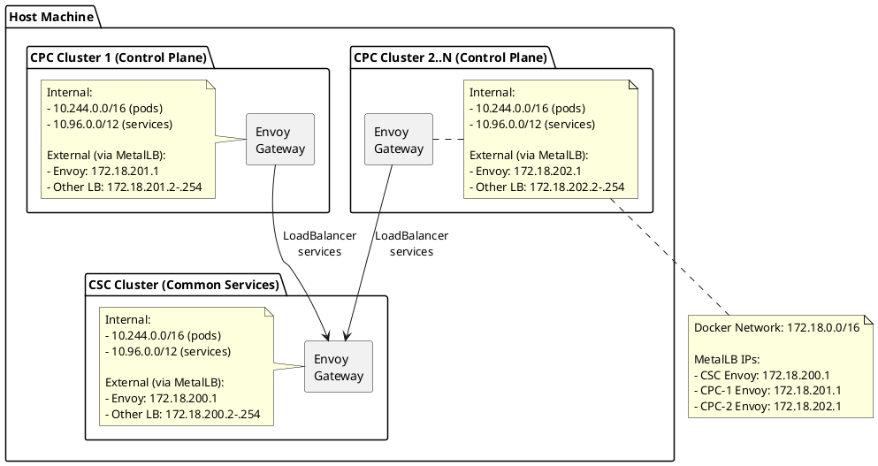

# Infrastructure Setup

This directory contains infrastructure for the local DSX Exchange environment.

## Overview

The infrastructure consists of:

- one Kind cluster
- MetalLB for LoadBalancer services
- Envoy Gateway controllers
- Metrics Server for resource metrics (CPU/memory)
- shared local IdP for OAuth2 authentication
- Prometheus for ServiceMonitor-backed metrics

## Quick Start

On macOS, install and start `docker-mac-net-connect` before running local tests
from the host. Linux hosts normally reach the Docker bridge IPs directly. See
[local/README.md](../README.md#macos-tweaks).

From the repository root:

```bash
make test
```

See [local/README.md](../README.md) for deploy-only, dev, test, and benchmark
targets.

## Local topology

The `kind-dsx-exchange` cluster runs all logical sites. Stable namespaces keep
site resources isolated:

- CSC: `csc-gateway`, `csc-event-bus`
- CPC-1: `cpc-1-gateway`, `cpc-1-event-bus`
- CPC-2: `cpc-2-gateway`, `cpc-2-event-bus`

## MetalLB Setup

MetalLB provides LoadBalancer service type support in Kind.

**Why MetalLB?**
MetalLB provides stable external IPs from the Docker network. CPC leaf
connections use the CSC Envoy address, so local tests still exercise the
Gateway path.

**Gateway IPs (on Docker network 172.18.0.0/16):**

- CSC: 172.18.200.1
- CPC-1: 172.18.201.1
- CPC-2: 172.18.202.1

These IPs are **separate and non-overlapping**.

**Configuration:**

```yaml
apiVersion: metallb.io/v1beta1
kind: IPAddressPool
metadata:
  name: csc-envoy-pool
  namespace: metallb-system
spec:
  addresses:
    # Reserved for the shared Envoy Gateway.
    - 172.18.200.1/32
  autoAssign: false
---
apiVersion: metallb.io/v1beta1
kind: IPAddressPool
metadata:
  name: csc-default-pool
  namespace: metallb-system
spec:
  addresses:
    # Available for future LoadBalancer services.
    - 172.18.200.2-172.18.200.254
---
apiVersion: metallb.io/v1beta1
kind: L2Advertisement
metadata:
  name: csc-l2-advert
  namespace: metallb-system
spec:
  ipAddressPools:
    - csc-envoy-pool
    - csc-default-pool
  interfaces:
    - eth0
```

## Envoy Gateway Setup

Envoy Gateway provides modern, high-performance HTTP/HTTPS ingress and API gateway capabilities.

**Usage:**

Each site owns a `shared-gateway` in its stable `*-gateway` namespace. It
provides TCP listeners for NATS (ports 1883, 4222, 7422), a TLS
passthrough listener for mTLS MQTT (port 8883), and an HTTP listener (port 80)
for the local IdP.

Example HTTPRoute for the local IdP:

```yaml
apiVersion: gateway.networking.k8s.io/v1
kind: HTTPRoute
metadata:
  name: idp
  namespace: idp
spec:
  parentRefs:
    - name: shared-gateway
      namespace: csc-gateway
  rules:
    - matches:
        - path:
            type: Exact
            value: /healthz
        - path:
            type: Exact
            value: /jwks.json
        - path:
            type: Exact
            value: /token
      backendRefs:
        - name: event-bus
          port: 5556
```

## Metrics Server

Kubernetes Metrics Server provides resource metrics (CPU/memory) for nodes and pods, enabling `kubectl top` commands and Horizontal Pod Autoscaling (HPA).

**Usage:**

```bash
# View node metrics
kubectl top nodes --context kind-dsx-exchange

# View pod metrics
kubectl top pods -n csc-event-bus --context kind-dsx-exchange
```

## Local IdP

The shared local IdP provides OAuth2 tokens for event bus and Agent Gateway
tests. The event bus issuer attaches to the CSC Gateway, and all sites access
it through `172.18.200.1`.

**Configuration:**

- **Grant Type**: Client Credentials (machine-to-machine authentication)
- **Scope**: `mqtt` (required for MQTT access)
- **Clients** (service accounts with client credentials enabled, shared across all sites):
  - `mqtt-client` / `mqtt-client-secret` (full access to test topics)
  - `mqtt-publisher` / `mqtt-publisher-secret` (publish only)
  - `mqtt-subscriber` / `mqtt-subscriber-secret` (subscribe only)

The IdP is exposed via Envoy Gateway on port 80 at the CSC cluster's MetalLB
LoadBalancer IP: `172.18.200.1`.

```bash
# Verify the IdP from the host
curl http://172.18.200.1/healthz
```

**Token Endpoint (all sites):**

- `http://172.18.200.1/token`

**JWKS Endpoint (used by auth-callout in all sites):**

- `http://172.18.200.1/jwks.json`

**Testing:**

```bash
# Obtain a token using client credentials grant
curl -X POST "http://172.18.200.1/token" \
  -H 'Content-Type: application/x-www-form-urlencoded' \
  -d 'grant_type=client_credentials' \
  -d 'client_id=mqtt-client' \
  -d 'client_secret=mqtt-client-secret' \
  -d 'scope=mqtt'
```

This IdP is an HTTP-only test fixture, not a production identity provider.

## Prometheus

The local stack installs a lightweight kube-prometheus-stack once per physical
cluster.

**Components:**

- Prometheus Operator
- Prometheus Server

**Access Prometheus:**

```bash
# Port-forward to Prometheus
kubectl port-forward -n monitoring svc/prometheus-kube-prometheus-prometheus 9090:9090 --context kind-dsx-exchange

# Open http://localhost:9090
```

## Network Architecture



**Key Design Points:**

The local topology validates namespace isolation, routing, chart wiring,
reconciliation, caching, and watchers. CPC-to-CSC federation traverses the CSC
Envoy Gateway address.

## Resource Requirements

**Minimum:**

- CPU: 4 cores
- Memory: 8 GB
- Disk: 20 GB

**Recommended:**

- CPU: 8 cores
- Memory: 16 GB
- Disk: 50 GB

The Kind control-plane node uses approximately 1 CPU and 2 GB RAM before
application workloads.

## Troubleshooting

### Cluster Creation Fails

```bash
# Check Docker resources
docker system info

# Increase Docker Desktop resources:
# Settings -> Resources -> Advanced
# - CPUs: 4+
# - Memory: 8GB+

# Clean up and retry
make clean
make local-up
```

### MetalLB Not Working

```bash
# Check MetalLB pods
kubectl get pods -n metallb-system --context kind-dsx-exchange

# Check logs
kubectl logs -n metallb-system -l app.kubernetes.io/name=metallb --context kind-dsx-exchange

# Verify IP pools
kubectl get ipaddresspools -n metallb-system --context kind-dsx-exchange
```

### Envoy Gateway Not Working

```bash
# Check Envoy Gateway controller
kubectl get pods -n envoy-gateway-system --context kind-dsx-exchange

# Check Gateway resources
kubectl get gateway -A --context kind-dsx-exchange
kubectl get httproute -A --context kind-dsx-exchange

# Check Gateway status
kubectl describe gateway shared-gateway -n csc-gateway --context kind-dsx-exchange

# Get LoadBalancer IP from Gateway resource
GATEWAY_IP=$(kubectl get gateway shared-gateway -n csc-gateway --context kind-dsx-exchange -o jsonpath='{.status.addresses[0].value}')
echo "Gateway IP: $GATEWAY_IP"

# Test gateway HTTP listener
curl http://${GATEWAY_IP}/
```

### Local IdP Not Working

```bash
# Check IdP pods
kubectl get pods -n idp --context kind-dsx-exchange

# Check logs
kubectl logs -n idp -l app.kubernetes.io/name=event-bus --context kind-dsx-exchange

# Test token endpoint via external IP using client credentials
curl -X POST "http://172.18.200.1/token" \
  -H 'Content-Type: application/x-www-form-urlencoded' \
  -d 'grant_type=client_credentials' \
  -d 'client_id=mqtt-client' \
  -d 'client_secret=mqtt-client-secret' \
  -d 'scope=mqtt'
```

### Prometheus Not Scraping

```bash
# Check ServiceMonitor resources
kubectl get servicemonitor -A --context kind-dsx-exchange

# Check Prometheus targets
# Access Prometheus UI and check Status -> Targets

# Verify service labels match ServiceMonitor selector
kubectl get svc -n csc-event-bus -o yaml --context kind-dsx-exchange
```

## Cleanup

```bash
# Delete the local cluster
make clean
```

## Next Steps

After the local stack is ready:

1. Reconcile the local stack after config or image changes:

   ```bash
   make local-up
   ```

2. Run tests:

   ```bash
   make test-dev
   ```

3. Inspect Prometheus targets:

   ```bash
   kubectl port-forward -n monitoring svc/prometheus-kube-prometheus-prometheus 9090:9090 --context kind-dsx-exchange
   ```
